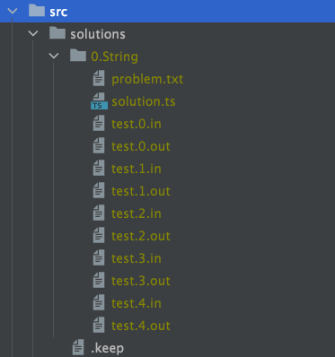
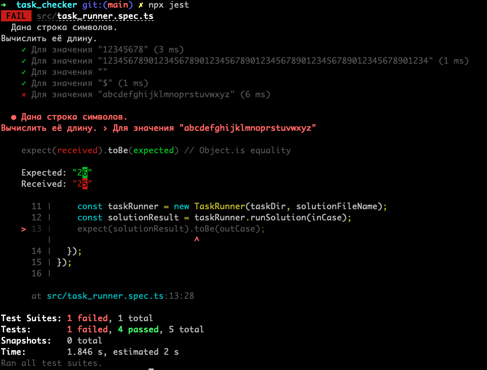

# Таск раннер для проверки домашних заданий

Для запуска нужнен nodejs версии не ниже 14

Инсталяция

```bash
npm install
```

Для проверки задания достаточно скопировать папку с набором тесткейсов и файла с решением.
Файл с решением должен иметь название solution.ts



Запуск тестов

```bash
npx jest
```

Пример вывода тестов


